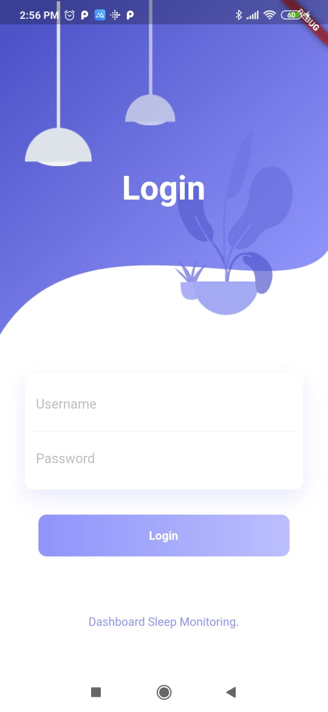
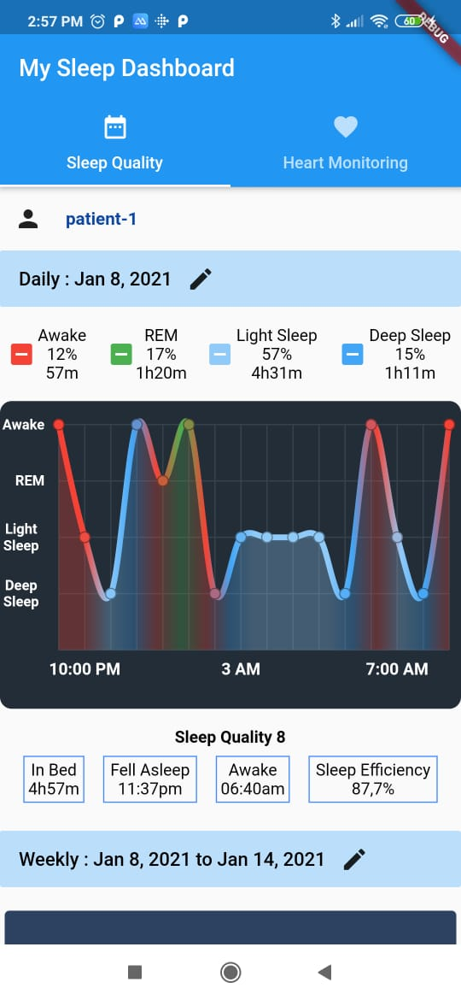
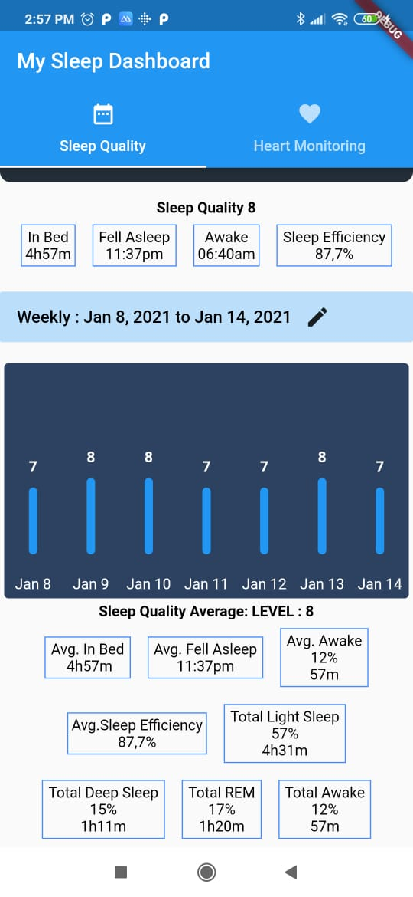
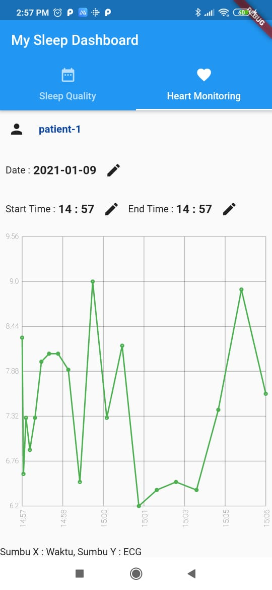
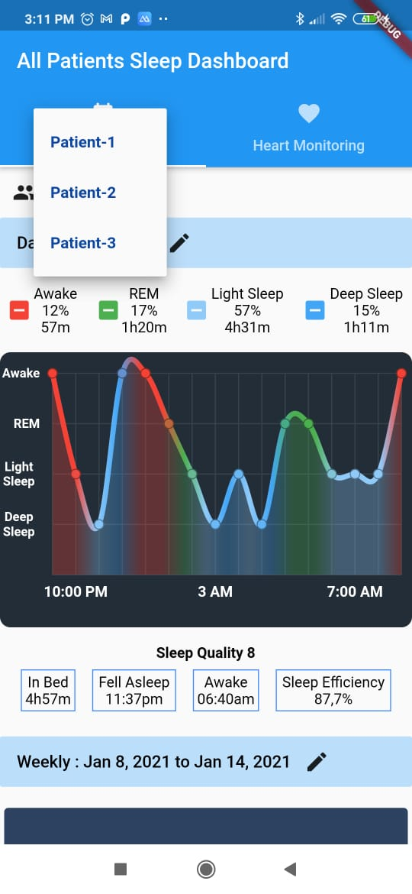

# Aplikasi Sleep Monitoring (Webservice (API) + Aplikasi Mobile)

- Web Service API Specifications : 
  Environtment  : Express JS (Javascript)
  Database      : postgresql 
  Feature       :
    1. Login
    2. Get Sleep Quality by Date
    3. Get Sleep Quality by Week
    4. Get Heart Rate By Date  
   
- Mobile APP Specifications : 
    Environtment  : Flutter & Dart Language
  Feature       :
    1. Login (Patient & Doctor)
    2. Show Sleep Quality by Date
    3. Show Sleep Quality by Week
    4. Monitoring Heart Rate

# Screenshots
 
  
 

